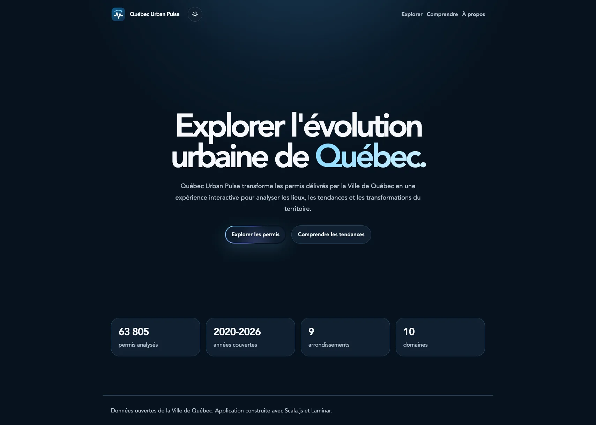
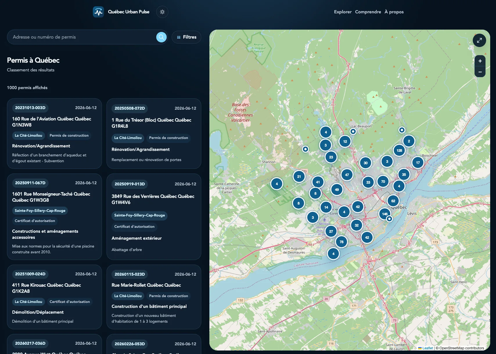
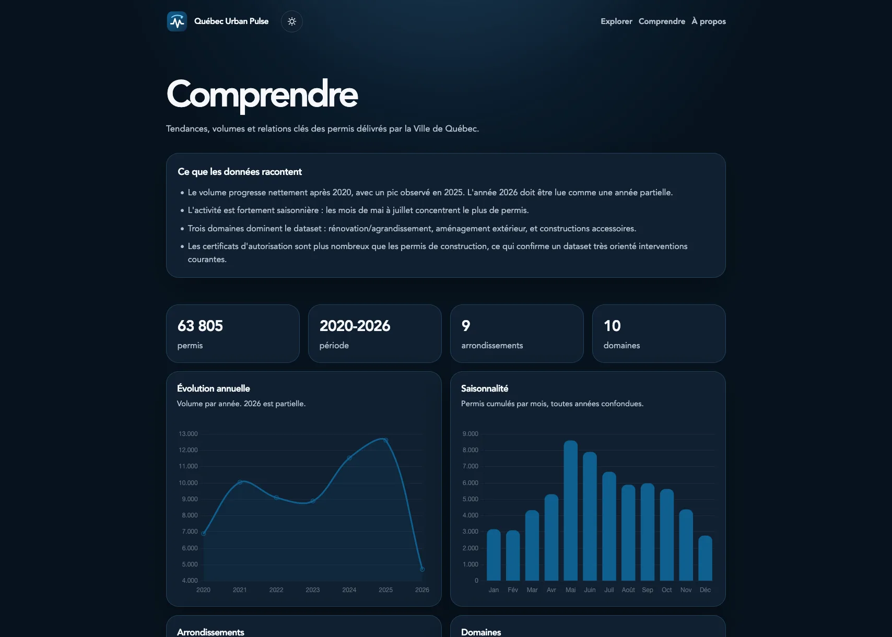

# Québec Urban Pulse

> Explorer l'évolution urbaine de Québec à travers les données ouvertes des
> permis délivrés.

Québec Urban Pulse est un weekend project consacré à l'analyse et à la
visualisation des permis délivrés par la Ville de Québec.

Le projet exploite Scala sur l'ensemble de la chaîne applicative, du traitement
des données au backend, et expérimente Scala.js pour construire une interface
web moderne. L'objectif est de transformer un jeu de données ouvertes en une
expérience interactive permettant d'observer l'évolution urbaine de Québec.

## Fonctionnalités

- carte interactive des permis géolocalisés ;
- recherche par adresse ou numéro de permis ;
- filtres par année, arrondissement, domaine, raison et type de permis ;
- fiches détaillées pour chaque permis ;
- indicateurs clés et visualisations statistiques ;
- résumé qualité des données nettoyées ;
- pipeline automatisé d'import et de nettoyage des données.

## Aperçu

### Accueil



### Explorer



### Comprendre



## Architecture

```text
Données ouvertes -> ETL Scala -> SQLite -> API REST -> Application Scala.js
```

Le dépôt est organisé en trois modules principaux :

- `etl/` importe, valide, nettoie et charge les données ;
- `backend/` expose les permis, les filtres et les agrégations via une API REST ;
- `frontend/` fournit la carte, la recherche et le tableau de bord.

Les scripts d'automatisation se trouvent dans `scripts/`. Les données brutes,
les fichiers transformés et la base SQLite locale sont stockés dans `data/` et
ne sont pas versionnés.

## Stack technique

### Backend et données

- Scala 3
- SBT
- http4s
- Circe
- Doobie
- SQLite

### Frontend

- Scala.js
- Laminar
- Leaflet
- Chart.js
- Cytoscape.js
- GSAP
- CSS natif

## Données

Le projet s'appuie sur le jeu de données ouvertes
[**Permis délivrés à la Ville de Québec**](https://www.donneesquebec.ca/recherche/dataset/permis-delivres-ville-de-quebec/resource/9555031e-cfc5-4b78-bec9-4ab84b549f67),
publié sur Données Québec par la Ville de Québec sous licence
[CC BY 4.0](https://www.donneesquebec.ca/licence/#cc-by). Il contient plus de
66 000 enregistrements comprenant notamment :

- le numéro et la date de délivrance du permis ;
- l'adresse et l'arrondissement ;
- le domaine, le type et la raison des travaux ;
- le lot concerné ;
- les coordonnées géographiques.

Le fichier CSV peut être téléchargé et validé avec :

```bash
./scripts/download_data.sh
```

Le script enregistre les données dans `data/raw/permits.csv`. Ce fichier est
généré localement et n'est pas versionné.

## Lancement local

Télécharger le fichier CSV officiel :

```bash
./scripts/download_data.sh
```

Construire les fichiers nettoyés et charger la base SQLite :

```bash
cd etl
sbt run
```

Lancer l'API REST :

```bash
cd backend
sbt run
```

Compiler et servir le frontend dans un autre terminal :

```bash
cd frontend
sbt fastLinkJS
python3 -m http.server 4174
```

L'application est ensuite disponible à l'adresse :

```text
http://localhost:4174/
```

## Licence

Ce projet est distribué sous licence MIT. Voir [LICENSE](LICENSE).
